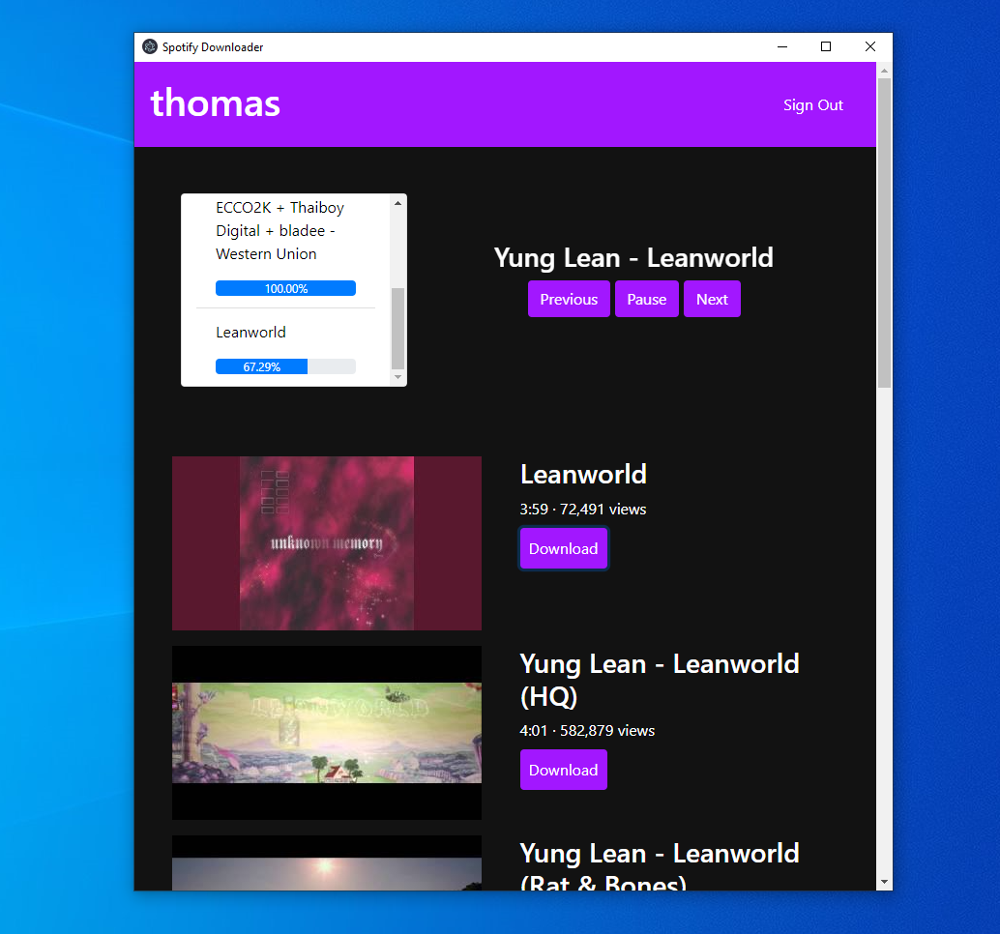

# spotify-downloader

Simple desktop app that detects your current playing song on Spotify and enables you to download the song in .mp3 format through Youtube Search and youtube-dl. 

Download for Window/MacOS on the [Releases](https://github.com/t-nguy/spotify-downloader/releases/tag/v0.1) page.

Created for learning purposes and not intended for intensive use because of Youtube API quota limits. (~100 searches a day)
